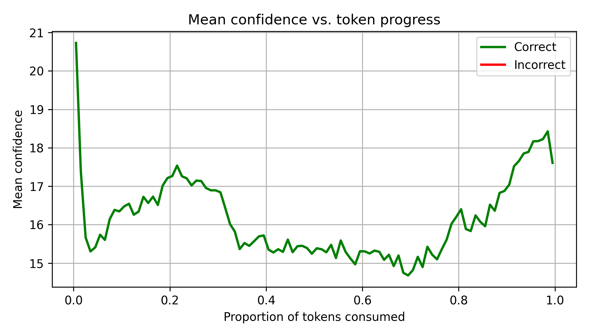
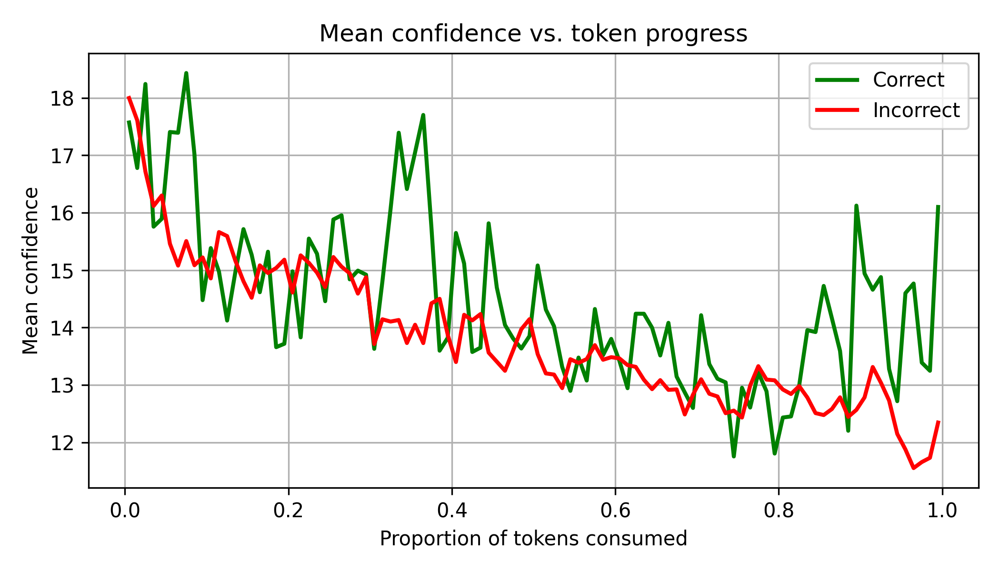
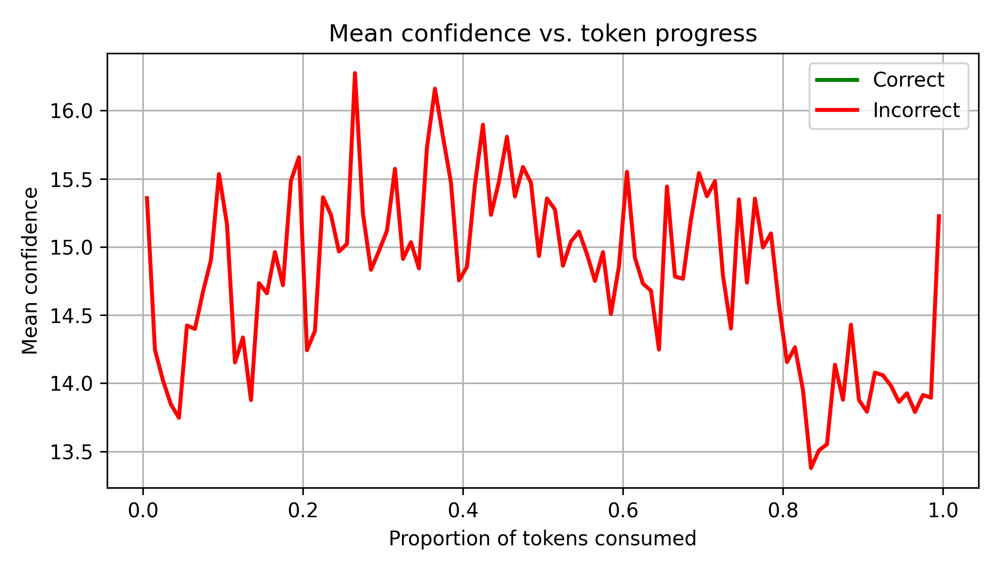

# This repository is an implementation of the paper : 
Deep Think with Confidence
https://arxiv.org/abs/2508.15260

-----------------------------------------------------------------------------

Deep Think with Confidence – AIME 2025 Analysis

This project aims to analyze the AIME 2025 dataset, which consists of 30 mathematical reasoning problems.

1. Trace Generation (generate_traces.py)

The generate_traces.py script loads the AIME 2025 dataset and the DeepSeek-Qwen3 model to generate reasoning trajectories (“traces”).
For each question, the script produces 52 traces, each with a maximum sequence length of 32,000 tokens.
This is a one-time process that took approximately 4 hours on a dual NVIDIA H100 GPU setup.
The resulting raw traces for all questions are stored in the output directory and can be reused for downstream analysis.

2. Trace Analysis (main.py)

The main.py script processes all the generated traces to:
	•	Evaluate the accuracy of reasoning across traces.
	•	Plot mean confidence versus token progress, visualizing how confidence evolves as reasoning unfolds.

3. Observations

Three representative examples are illustrated below:

	1.	Case 1 – High consensus:

Most traces converge to the correct solution early and maintain high confidence throughout.

	2.	Case 2 – Partial success:

Only a subset of traces arrive at the correct solution.
A notable observation is that correct traces exhibit distinctly higher tail confidence values, aligning with the hypothesis presented in the Deep Think with Confidence paper — that tail confidence can serve as a strong indicator of correctness.

	3.	Case 3 – No correct solutions:

None of the traces reach the correct answer.
Interestingly, the absolute confidence values remain low across all tokens, suggesting that a confidence-based metric could be used to:
	•	Detect low-certainty cases,
	•	Trigger additional trace generation, or
	•	Adaptively modify the prompt to improve reasoning outcomes.

All generated result plots for individual questions are available in the results/ directory.

⸻

